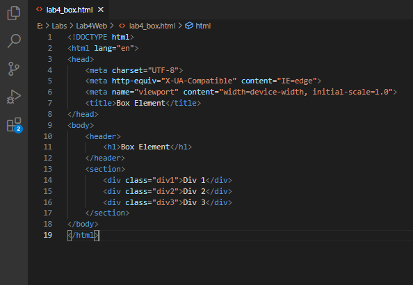
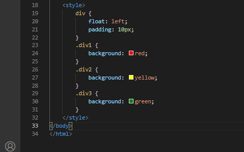
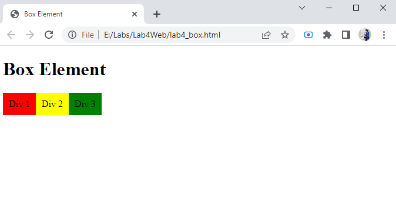
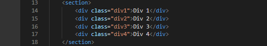
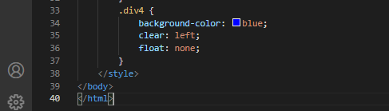
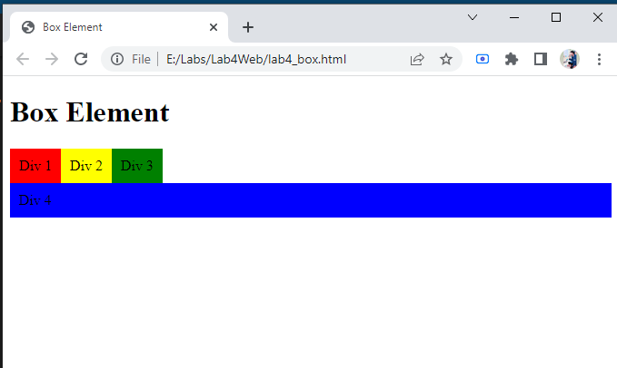
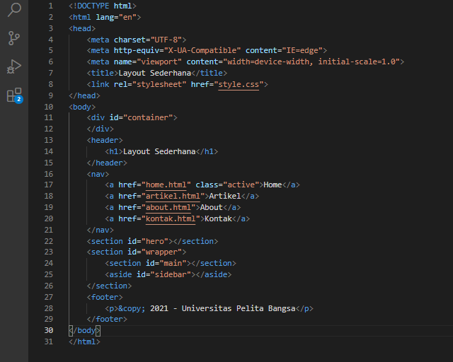
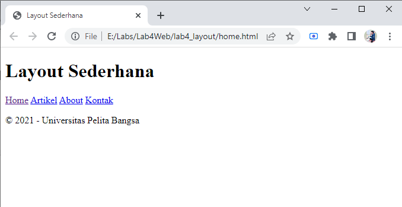
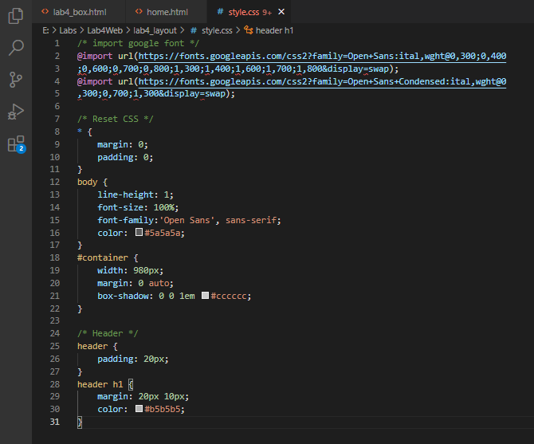

# Lab4Web
## Belajar Membuat Box Element

Langkah pertama yaitu menyiapkan dokumen HTML terlebih dahulu, kemudian tambahkan kode
untuk membuat box element dengan tag `
` , contoh nya seperti gambar dibawah ini :

Kemudian tambahkan deklarasi CSS untuk membuat float element, Perhatikan gambar dibawah ini :

Lihart tampilan di Website 

### Mengatur Clearfix Element

Clearfix digunakan untuk mengatur element setelah float element. Property clear digunakan untuk mengaturnya.
Tambahkan element `<div4>` 

Kemudian atur CSS nya seperti ini 

Maka tampilan di Website akan seperti ini 

### Belajar Membuat Layout Sederhana

Yang pertama kita membuat file HTML terlebih dahulu, dan juga bikin file CSS nya, dibawah ini contoh file HTML nya :

Deklarasikan dengan CSS seperti gambar dibawah ini :

dan lihat tampilan Website nya akan seperti ini :

    